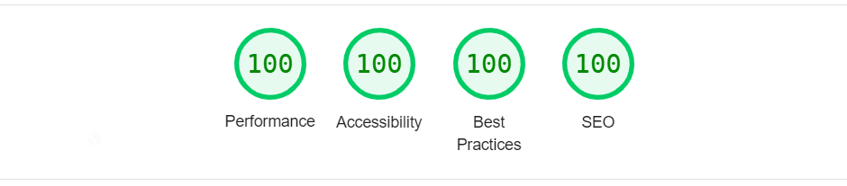

# “Would You Rather?” Project

####

This project is a part from Udacity's Advanced Front-End Web Development Nanodegree Program.

A web app that lets a user play the “Would You Rather?” game.

&nbsp;

## 🎉 Live Site

[View Live](https://would-you-rather.mostafaellethy.com/)

&nbsp;

## ✨ Features

<ul>
  <li>Authentication</li>
  <li>Questions Listing (Answered - Unanswered)</li>
  <li>Add New Question</li>
  <li>Submit Answer</li>
  <li>View Poll</li>
  <li>Leaderboard</li>
  <li>Containerized App</li>
</ul>

&nbsp;

## 🚀 Performance



<sup>Scores calculated with Lighthouse 9.6.2.</sup>

&nbsp;

## Built With

- [React](https://reactjs.org/)
- [Redux](https://redux.js.org/)
- [React-Redux](https://react-redux.js.org/)
- [React-Router](https://reactrouter.com/en/main)
- [MUI](https://mui.com/)

&nbsp;

## Setup

```bash
# Install dependencies
$ npm install

# Compiles and hot-reloads for development
$ npm run start

# Compiles and minifies for production
$ npm run build
```

&nbsp;

## Note

The state will not persist across refresh.
